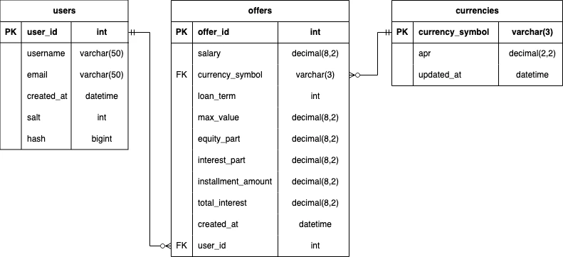

# Database schema documentation

## Database view

## Description

The schema of this database consists of three main tables. The `offers` table has two foreign keys. The first is `offers.currency_symbol`, which is related to the `currencies.currency_symbol` primary key and the second one `offers.user_id`, which is associated with the `users.user_id` primary key.

## Cardinality

1. **PK**: `offers.currency_symbol` **FK**: `currencies.currency_symbol`

    - Between the `users` and `offers` table.
        - **zero ro many**
        - Each user can have zero or infinitely many offers.

    - Between the `offers` and `users` table.
        - **one and only one**
        - Each offer must have only one owner.

2. **PK**: `offers.user_id` **FK**: `users.user_id`

    - Between the `offers` and `currencies` table.
        - **one and only one**
        - Each offer must contain only one currency.

    - Between the `users` and `offers` table.
        - **zero or many**
        - Any currency can be included in a offer an infinite number of times or not at all.